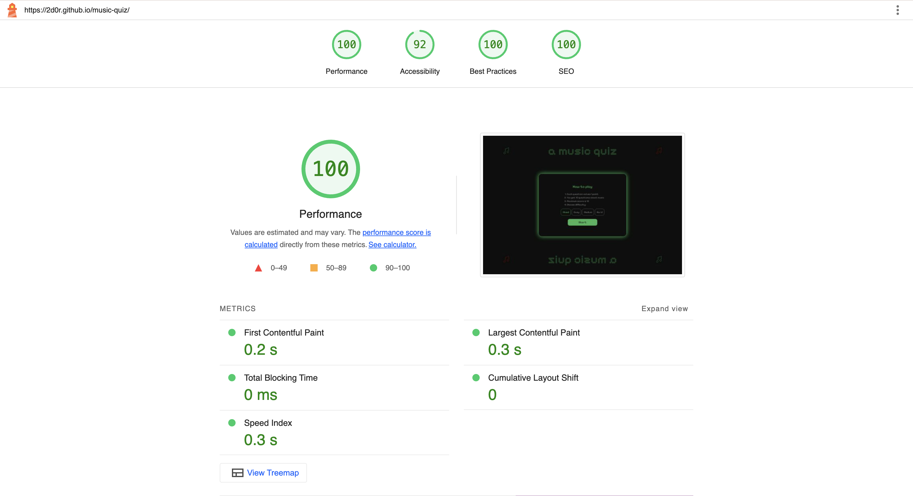

## Overview

Welcome to a(nother) music quiz! This README file provides essential information about the website, its purpose, and how to get started.

The website can be accessed via this [Link](https://2d0r.github.io/music-quiz/)

## Introduction

<i>A music quiz</i> is a Spotify-themed, pixelated music quiz for every music nerd out there curious to test their guilty pleasures' knowledge. The experience is bound to leave a mark, at every wrong answer's reddification of the screen. But not without the opportunity to learn and do better next time. The questions are different each time, thanks to Trivia API's database, and will only grow in number as time passes. Give it you best musical shot!

## User Stories
<h3>First Time Visitor Goals:</h3>

- As a first-time visitor, I want to easily understand the main purpose of the site and what it does.
- As a first-time visitor, I want to easily navigate the controls of the game.
- As a first-time visitor, I want to quickly start the game since that's what I'm here for.
- As a first-time visitor, I want to have a good time testing my knowledge of music culture.

<h3>Returning Visitor Goals:</h3>

- As a returning visitor, I want to try my luck again to see if I can improve my score.
- As a returning visitor, I want to see the same familiar game layout so I can get straight into a new game.
- As a returning visitor, I want to test my knowledge again but not have the exact same experience again otherwise I'll just memorize the questions.
- As a returning visitor, I want to test a higher difficulty since I may have learnt more since last time.
- As a returning visitor, I want to get my friends to play to compare scores.

<h3>Frequent Visitor Goals:</h3>

- As a frequent visitor, I want to keep practicing to improve my knowledge of music and my score.
- As a frequent visitor, I want to improve my music culture skills ahead of the weekly pub quiz.
- As a frequent visitor, I want to get my friends to have a go as well and see who gets the highest score.

<h3>Target Audience:</h3>

- Interested in quizzes.
- Interested in music.
- Interested in pop culture.
- Interested in casually playing online games, on my own or with friends.
- User of or familiar with Spotify.

## Features

<h3>The website exists on one page only with multiple features visible to the user:</h3>

- At the top and bottom of the page is the site name and its logo.
- In the middle of the page is a box where all the interactive content is displayed. 
- On first load, this displays a How-to guide, a difficulty selection and a  "Start" button for the user to start the game.
 

- When the user clicks <i>Start</i>, the first question is displayed.
 

- All of the buttons on the site offer the user feedback with on-hover animations and pointers.
- Within the quiz, the user will get instant feedback for a correct answer.
- After selecting an answer, the user will only be able to click <i>Next</i> as all the answer buttons are disabled.
- Each time the user selects one of four answers the correct answer will turn green.
 

- The user will also get feedback for an incorrect answer.
- The user will see that the answer they selected is now red, alongside other elements of the UI, indicating that it was a wrong answer, and that they can move to the next question.
- While both incorrect selection and correct answers are highlighted, the user's selection is emphasised by a sublty coloured background.
 

- The user will see their score only at the end, creating a sense of surprise.
 

- Using the site is intuitive and easy to understand.

- The website is responsive:
  - on laptop screen sizes and larger, the website will feature larger text and buttons.
  - on tablet screen sizes and smaller, the website text and buttons will be smaller.
  - on phone screens, horizontal grids are displayed as a column.
  - on landscape phone screens, the header and footer move to the sides of the site.

## Technologies Used

- [HTML](https://developer.mozilla.org/en-US/docs/Web/HTML) was used as the foundation of the site.
- [CSS](https://developer.mozilla.org/en-US/docs/Web/css) was used to add the styles and layout of the site.
- [CSS Flexbox](https://developer.mozilla.org/en-US/docs/Learn/CSS/CSS_layout/Flexbox) was used to arrange items symmetrically on the pages.
- [CSS Grid](https://developer.mozilla.org/en-US/docs/Web/CSS/grid) was used to arrange answers in a consistent grid.
- [JavaScript ES7](https://developer.mozilla.org/en-US/docs/Web/JavaScript) was used to create all the logic and visuals necessary to make the quiz work, including the async API fetch functionality.
- [VSCode](https://code.visualstudio.com/) was used as the main tool to write and edit code.
- [Git](https://git-scm.com/) was used for the version control of the website.
- [GitHub](https://github.com/) was used to host the code of the website.
- [Open Trivia Database](https://opentdb.com/api_config.php) was used to fetch questions from an open-source online database of trivia questions.

## Testing

<h3>Compatability</h3>

In order to confirm the correct functionality, responsiveness and appearance:
- The website was tested on Chrome and Safari web browsers, using in-built dev tools.
  - Chrome:
  
  

  - Edge:
  
  

- The website's responsiveness was tested using Media Genesis Responsive design checker
https://responsivedesignchecker.com/
 

- The HTML file has passed HTML validity checks with W3C.
 

- The CSS file has also passed CSS validity check with W3C.
 

- The JavaScript was tested for errors using JShint
 

- Lighthouse
  - The website has been tested for performance, accessibility, best practice and SEO. 

    

## Deployment

### Deployment to GitHub Pages

- The site was deployed to GitHub pages. The steps to deploy are as follows: 
  - In the [GitHub repository](https://github.com/2d0r/music-quiz), navigate to the Settings tab 
  - From the source section drop-down menu, select the **Main** Branch, then click "Save".
  - The page will be automatically refreshed with a detailed ribbon display to indicate the successful deployment.

  The live link can be found [here](https://2d0r.github.io/music-quiz/)

## Contact

Tudor Popescu 
tudor.m.p@outlook.com

Feel free to reach out if you have any questions or feedback! Thank you for visiting  https://github.com/2d0r/music-quiz

## Credits

<h3>Inspiration</h3>

- Ben Allwright's example project
- Spotify UI

<h3>Media</h3>

The website features:
- one licenced icon sourced from https://thenounproject.com/
- the PixelifySans font from https://fonts.google.com/specimen/Pixelify+Sans